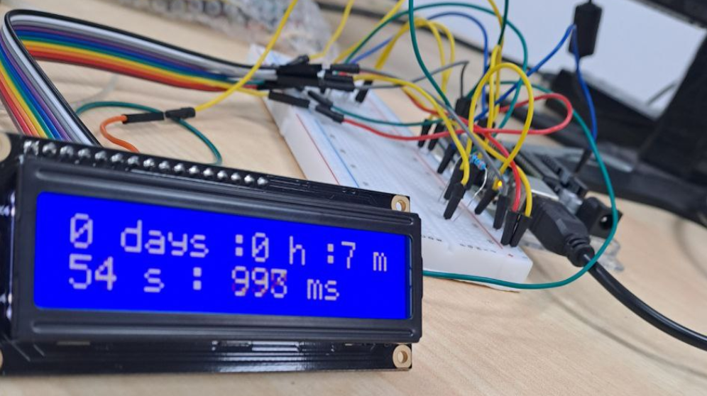

# ⏱ Arduino LCD Stopwatch Project

[](Assets/stopwatch.mp4)

## 🎥 Video
https://github.com/drearyJaysmabirt/Arduino-LCD-Stopwatch/blob/main/Assets/stopwatch.mp4

## 📋 Features
- Tracks time up to days with millisecond precision
- Displays on 16x2 LCD
- Simple 4-bit mode wiring

## 📚 Libraries Needed
Install via Arduino IDE:
1. Sketch → Include Library → Manage Libraries
2. Search for "LiquidCrystal"
3. Install the official Arduino library

## 🛠 Hardware Setup

| LCD Pin | Arduino Connection |
|---------|--------------------|
| VSS     | GND                |
| VDD     | 5V                 |
| RS      | Pin 12             |
| RW      | GND                |
| E       | Pin 11             |
| DB4-DB7 | Pins 5,4,3,2       |

## 💻 Code
```arduino
#include <LiquidCrystal.h>
LiquidCrystal lcd(12, 11, 5, 4, 3, 2);

void setup() {
  lcd.begin(16, 2);
  // ... (rest of your code)
}
```
[View Full Code](Arduino/ArduinoUno_functionalstopwatchuptodays.ino)

## 🔌 How to Use
1. Upload the sketch
2. Time starts automatically
3. Reset Arduino to restart timer
